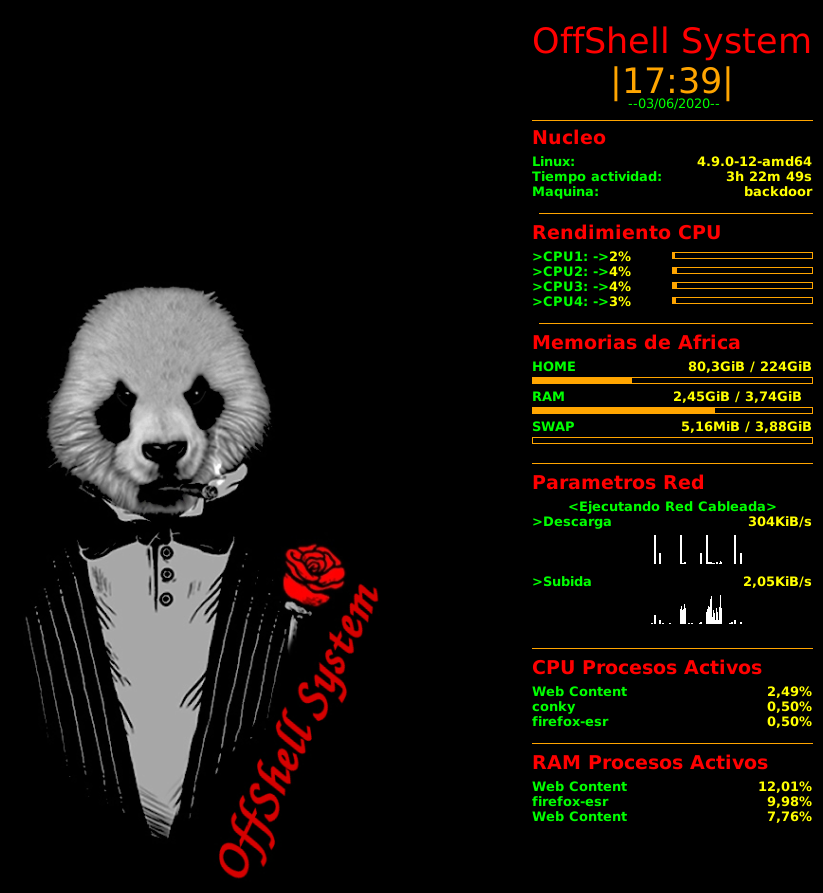

# Conky-config
Configuración OffShell System personalizada de conkyrc para CPU de 4 núcleos y conexión de red cableada.

# Vídeo tutorial para la instalación de Conky en sistemas Debian y derivados.  
Solo necesitas seguir la instalación y después copiar en el archivo conkyrc, la configuración que dejo en el repositorio y tendrás este fabuloso conky en tu escritorio.  
Vídeo Tutorial -> https://www.youtube.com/watch?v=UjbG0ZYk6ls

# Visita la web de OffShell System y descubre nuestra comunidad.  
-> https://offshellsystem.github.io/offshellsystem/
